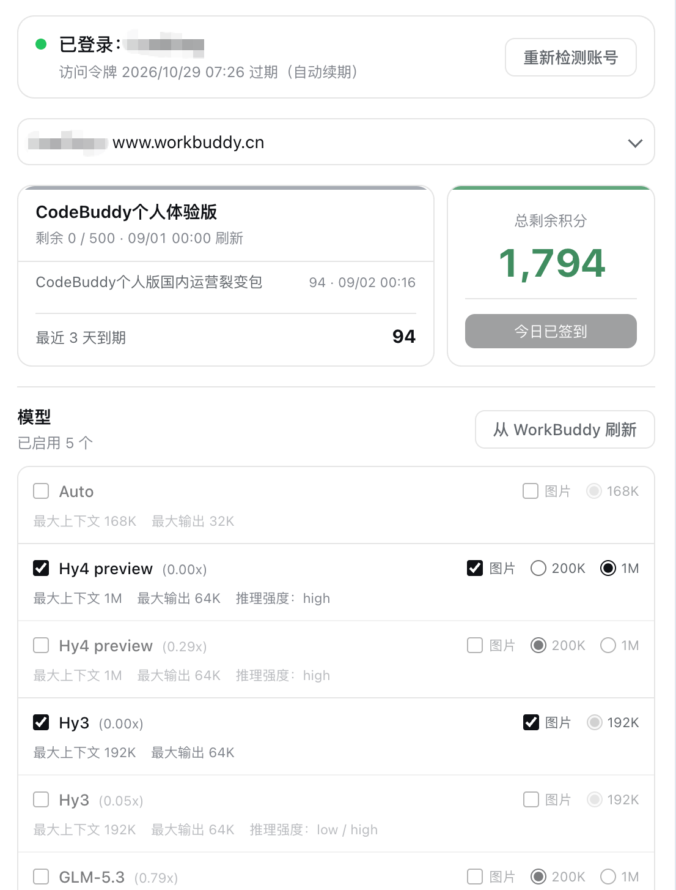
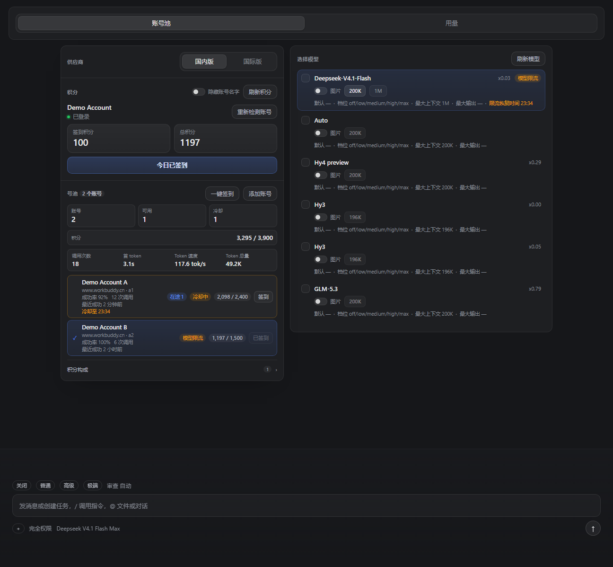

<p align="center">
  
</p>

<h1 align="center">dsh-wb-plus</h1>

<p align="center"><b>WorkBuddy 的社区增强版 DSH 接入：国内版 / 国际版双号池、积分、用量、模型档位与限流状态。</b></p>

<p align="center">
  <a href="README.en.md">English</a> ·
  <a href="#功能特性">功能特性</a> ·
  <a href="#安装">安装</a> ·
  <a href="#构建与验证">构建与验证</a> ·
  <a href="CHANGELOG.md">更新日志</a> ·
  <a href="https://github.com/Animal2404/dsh-wb-plus/issues">问题反馈</a>
</p>

> 这是非官方社区增强版，基于 MIT 许可的
> [`dingminhua/dsh-connect-workbuddy`](https://github.com/dingminhua/dsh-connect-workbuddy)
> 构建，并叠加本地补丁。插件内部仍使用 `dsh-connect-workbuddy` 作为稳定插件 ID，
> 以免破坏已有安装与配置；仓库与展示名称为 **dsh-wb-plus**。

## 功能特性

- **国内版 + 国际版并行**：注册为 `workbuddy` / `workbuddy-global` 两个供应商，可同时在线，账号与模型目录互不干扰。
- **账号池管理**：显示每个账号的积分、可用/冷却状态、成功率、调用次数、最近成功时间，支持一键签到与添加账号。
- **模型管理**：按模型显示积分倍率、图片能力、上下文档位、最大输出与推理档位；支持启用、切换与刷新。
- **默认最高思考强度**：支持 `max` 的模型（如 `DeepSeek-V4.1-Flash`、`GLM-5.3`）默认档位显示为 `max`。
- **账号级 / 模型级限流分开显示**：账号完全冷却时显示「冷却中」；仅单个模型被限流时，在模型行显示「模型限流」与「限流恢复时间」。
- **号池与令牌信息**：号池标题标注 `CN` / `AI`；每个账号显示访问令牌到期时间与自动续期提示；号池汇总显示近 3 天内到期的积分。
- **用量分析**：按小时堆叠图 + 按账号 / 模型 / 域明细，包含输入、输出、缓存命中、失败、平均延迟、token 速度与 token / 积分。
- **用量持久化**：小时账本落盘，重启后号池读条与用量历史仍可恢复。
- **完整面板**：`账号池 / 用量` 两个页签，设置偏好写入浏览器本地存储。
- **单一管理入口**：国内/国际切换位于模型卡，旧的上游设置卡片已移除，避免两套界面重复。



## 安装

前置：已安装并登录 WorkBuddy 桌面 App。

本仓库是一个可直接安装的 DSH bundle 插件。以 web profile 为例：

```sh
git clone https://github.com/Animal2404/dsh-wb-plus.git
dsh plugin --profile web add link:./dsh-wb-plus
```

安装后重启对应的 DSH 进程即可。插件复用 WorkBuddy 桌面端的登录状态，不需要额外的 OAuth 流程；插件本身不会把 WorkBuddy token 交给 DSH 模型适配器。

## 工作原理

```text
DSH PiAiAdapter（国内版 / 国际版各一套）
  -> 安全 loopback shim（随机端口 + 进程内随机 secret）
  -> WorkBuddyUpstreamClient
  -> 国内版 copilot.tencent.com / 国际版 workbuddy.ai
  -> WorkBuddy SSE
```

账号池、积分与用量数据来自插件自身的只读路由；模型级限流在聊天请求被上游拒绝时记录，不参与账号冷却计数。

## 构建与验证

本仓库同时包含已构建的 `lib/*.js` 和可复现的 `sidebar/` 面板源码。

```sh
# 语法检查
npm run check:syntax

# 宿主路由 / 限流 / 用量回归
npm run test

# 用真实 Chrome 渲染面板，并检查模型限流与恢复时间
npm run render:harness
npm run render:check
```

`patches/dsh-connect-workbuddy@2.0.2.patch` 是对上游 npm 包的完整 pnpm 补丁，覆盖 `lib/client.js`、`lib/index.js` 与 `lib/host-heartbeat-CaS5Koaw.js`；从上游 pristine 应用后应与仓库中的 `lib/` 逐字节一致。

## 与上游的关系

- 上游项目：[`dingminhua/dsh-connect-workbuddy`](https://github.com/dingminhua/dsh-connect-workbuddy)，MIT License，Copyright (c) 2026 LaoDing。
- 本仓库保留上游的 MIT 许可证、版权声明与第三方声明，详见 [`THIRD_PARTY_NOTICES.md`](THIRD_PARTY_NOTICES.md)。
- 本仓库的增强内容集中在面板、账号池、用量、冷却/限流判定与添加账号流程；不包含 WorkBuddy 官方源码，也不修改桌面端文件。

## 免责声明

本项目仅供个人学习与自用，与 WorkBuddy / CodeBuddy / DeepSeek 官方无关联。请遵守上游服务条款，不要用于滥用、绕过配额或规避风控。
